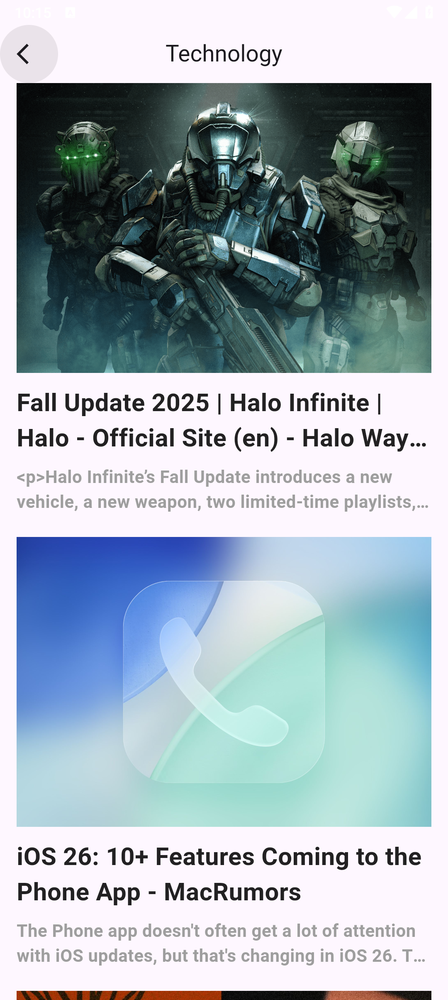
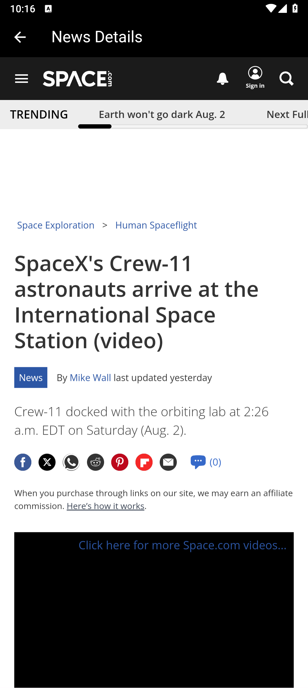

# News App

## Overview
**News App** is a Flutter application that delivers the latest news articles from various categories like Technology, Sports, and Health. Users can browse categories, view detailed articles, and read full content using a built-in WebView. The UI is clean, responsive, and designed for a smooth user experience.

## Screenshots

<p align="center">
  
  
  
  
  
  
</p>

## Features
- Browse news by categories (Technology, Sports, Health)
- Display headlines, summaries, and images in a card format
- Tap on a news item to view full content in an embedded WebView
- Responsive design using `flutter_screenutil`
- Image caching using `cached_network_image`

## Getting Started

### Requirements
- Flutter SDK >= 3.8.1
- Dart SDK

### Installation

1. **Clone the repository**
   ```bash
   git clone https://github.com/OmarGamalDev/news-app.git
   cd news-app
```

2. **Install dependencies**

   ```bash
   flutter pub get
   ```

3. **Run the app**

   ```bash
   flutter run
   ```

## Packages Used

* [`dio`](https://pub.dev/packages/dio): For making HTTP requests
* [`cached_network_image`](https://pub.dev/packages/cached_network_image): For efficient image loading and caching
* [`webview_flutter`](https://pub.dev/packages/webview_flutter): To display full news articles
* [`flutter_screenutil`](https://pub.dev/packages/flutter_screenutil): For responsive UI
* [`cupertino_icons`](https://pub.dev/packages/cupertino_icons): iOS-style icons

## Notes
This app is intended for learning and demonstration purposes. It showcases API integration using Dio, navigation between screens, displaying data dynamically, and WebView usage inside Flutter.
